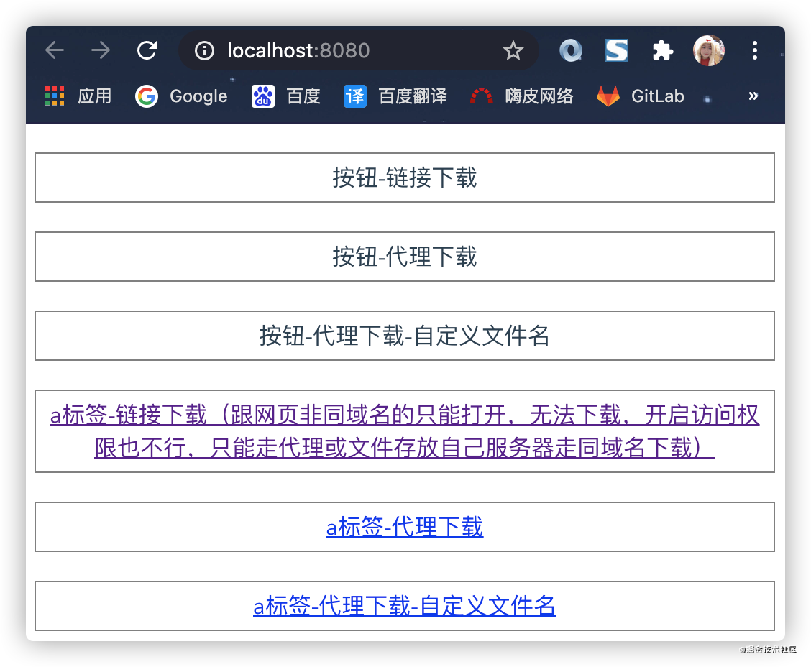

# DZMH5Dowload
Vue 下载任何URL文件 Demo



通过 npm 引入

```
npm i dzm-download-h5
```

然后在 main.js 中进行导入

```
import Vue from 'vue'
import App from './App.vue'
import router from './router'
import store from './store'

// import {
  DOWLOAD_FILE,
  DOWLOAD_FILE_PRO,
  DOWLOAD_FILE_URL,
  DOWLOAD_FILE_URL_PRO,
  DOWLOAD_FILE_NAME 
} from 'dzm-download-h5'
import DZMH5Download from 'dzm-download-h5'
Vue.prototype.$download = DZMH5Download

Vue.config.productionTip = false

new Vue({
  router,
  store,
  render: h => h(App)
}).$mount('#app')
```

vue 文件中使用

```
<script>

export default {
  methods: {
    // 按钮-链接下载
    touchProxyDowload1 () {
      // 下载指定全链接
      // 由于服务器配置不一样，有的链接会报跨域错误，如果报跨域错误只能走代理下载，也可以要求服务器修改文件访问权限配置

      // 这是一个与当前网页同域名的链接，用于测试。
      // DOWLOAD_FILE_URL('http://localhost:8082/dzm.png')
      // 直接下载文件
      // DOWLOAD_FILE_URL('http://api-okr.netjoy.com/dowload/2021-04-12_15-21-50.xlsx')

      // 例如：服务器打开权限运行访问（七牛地址）下载成功
      this.$dowload.DOWLOAD_FILE('https://file.hepai.video/local/other/6c5d7e97341b2d2806917ee797034835.png')
      
      // 例如：服务器没有打开权限运行访问（百度图片）下载失败，跨域错误，那就只能走跨域
      // DOWLOAD_FILE('http://api-okr.netjoy.com/dowload/2021-04-12_15-21-50.xlsx')
    },
    // 按钮-代理下载（代理配置存放在 vue.config.js，也可以放在服务器中配置）
    touchProxyDowload2 () {

      // 有后缀的则会使用当前后缀图片名称，也可以像上面那样自定义
      this.$dowload.DOWLOAD_FILE('/files/pic/pic9/202103/hpic3704.jpg', '/dowload2')

      // DOWLOAD_FILE('/local/other/3c746d682c7c821c7a792698625dac45.mp4', '/dowload3')
    },
    // 按钮-代理下载-自定义文件名（代理配置存放在 vue.config.js，也可以放在服务器中配置）
    touchProxyDowload3 () {
      // 这种没有后缀的图片需要自己传入图片名称带后缀.png .jpg ...
      this.$dowload.DOWLOAD_FILE_PRO('/image_search/src=http%3A%2F%2Fattach.bbs.miui.com%2Fforum%2F201311%2F17%2F174124tp3sa6vvckc25oc8.jpg&refer=http%3A%2F%2Fattach.bbs.miui.com&app=2002&size=f9999,10000&q=a80&n=0&g=0n&fmt=jpeg?sec=1618976641&t=ca698f4ed0e96eb2f269ccff644bda03', 'avatar.png', '/dowload1')
    }
  }
}
</script>
```
